# System Architecture

> _This document outlines the proposed architecture for implementation._

## 🏗 High-Level Design

The system follows a **Hybrid Headless** architecture. The frontend is decoupled from the content (Sanity) and the business logic (Neon CRM).

```mermaid
flowchart TB
    subgraph Frontend["🖥️ Frontend Layer"]
        NextJS["Next.js 15<br/>(App Router)"]
    end

    subgraph Backend["☁️ Backend Services"]
        Firebase["Firebase<br/>(Auth + Functions)"]
    end

    subgraph ExternalServices["🔌 External Services"]
        Sanity["Sanity CMS<br/>(Content)"]
        Neon["Neon CRM<br/>(Member Data)"]
        Stripe["Stripe/Neon Pay<br/>(Payments)"]
    end

    NextJS <--> Firebase
    NextJS <--> Sanity
    Firebase <--> Neon
    Firebase <--> Stripe
```

---

## 🔐 The "Bridge" Pattern (Member Verification)

We do **not** duplicate the Neon database. We verify against it in real-time.

```mermaid
sequenceDiagram
    autonumber
    actor User
    participant UI as Next.js Frontend
    participant Auth as Firebase Auth
    participant Fn as Cloud Function
    participant CRM as Neon CRM API

    User->>UI: Click "Sign In"
    UI->>Auth: Authenticate (Google/Email)
    Auth-->>UI: Return Firebase Token

    UI->>Fn: verifyMembership(token)
    Fn->>CRM: GET /accounts?email={user.email}

    alt enrollment_status === 'Active'
        CRM-->>Fn: { status: "Active" }
        Fn-->>UI: { isMember: true }
        UI-->>User: Show Member Pricing 🎉
    else Not Active
        CRM-->>Fn: { status: "Expired/None" }
        Fn-->>UI: { isMember: false }
        UI-->>User: Show Public Pricing
    end
```

---

## 🔄 Data Flow Diagrams

### 1. Content Rendering (Static/Revalidated)

```mermaid
flowchart LR
    A["📝 Board Member<br/>(Sanity Studio)"] --> B["☁️ Sanity<br/>Content Lake"]
    B --> C["⚙️ Next.js<br/>Build/Revalidate"]
    C --> D["🌐 Public Website"]

    style A fill:#f9f,stroke:#333
    style D fill:#9f9,stroke:#333
```

### 2. Event Registration (Dynamic)

```mermaid
flowchart LR
    A["👤 User"] --> B["📅 Event Page"]
    B --> C["🎟️ Select Ticket"]
    C --> D["💳 Stripe/Neon Pay"]
    D --> E["🔔 Webhook"]
    E --> F["📊 Update Neon CRM"]

    style A fill:#bbf,stroke:#333
    style F fill:#9f9,stroke:#333
```

### 3. Graceful Degradation (Neon CRM Unavailable)

---

## 🔐 Security Model

```mermaid
flowchart TB
    subgraph Client["🖥️ Client (Browser)"]
        App["Next.js App"]
    end

    subgraph Server["🔒 Server (Firebase)"]
        Functions["Cloud Functions"]
        Secrets["Secret Manager<br/>(Neon API Key)"]
    end

    subgraph External["🌐 External"]
        NeonAPI["Neon CRM API"]
    end

    App -->|"Auth Token Only"| Functions
    Functions --> Secrets
    Secrets -->|"Inject Key"| Functions
    Functions -->|"Authenticated Request"| NeonAPI

    style Secrets fill:#f99,stroke:#333
    style App fill:#9bf,stroke:#333
```

| Security Measure  | Implementation                                               |
| ----------------- | ------------------------------------------------------------ |
| **Neon API Keys** | Stored in Firebase Secret Manager. NEVER exposed to client.  |
| **CMS Access**    | Role-based access within Sanity (Editor vs. Admin)           |
| **Auth Tokens**   | Short-lived Firebase ID tokens with server-side verification |
