# User Stories & Functional Requirements

> _This document captures functional requirements organized by user persona._

## 🎭 Persona Overview

```mermaid
flowchart TB
    subgraph Personas["User Personas"]
        VP["👤 Young Professional<br/>(Potential Member)"]
        BM["🛡️ Board Member<br/>(Admin)"]
        SYS["🤖 System<br/>(Automation)"]
    end

    subgraph Goals["Primary Goals"]
        G1["Discover Events"]
        G2["Understand Value"]
        G3["Manage Content"]
        G4["Automate Tasks"]
    end

    VP --> G1
    VP --> G2
    BM --> G3
    SYS --> G4
```

---

## 👤 Persona: The "Young Professional" (Potential Member)

### User Journey

### Stories

| Story                                                                                          | Acceptance Criteria                                         |
| ---------------------------------------------------------------------------------------------- | ----------------------------------------------------------- |
| As a visitor, I want to see "Upcoming Events" immediately on the homepage                      | Events section visible above the fold                       |
| As a visitor, I want to clearly see the price difference between Member and Non-Member tickets | Both prices displayed side-by-side with savings highlighted |
| As a mobile user, I want the navigation menu to be usable on my iPhone                         | Hamburger menu, touch-friendly, address easily findable     |

---

## 🛡️ Persona: The Board Member (Admin)

### Content Management Flow

```mermaid
flowchart LR
    A["🔍 Spot Typo/Issue"] --> B["🖱️ Click Edit Button"]
    B --> C["📝 Sanity Studio Opens"]
    C --> D["✏️ Make Changes"]
    D --> E["💾 Publish"]
    E --> F["🔄 Site Revalidates"]
    F --> G["✅ Live on Website"]

    style A fill:#f99,stroke:#333
    style G fill:#9f9,stroke:#333
```

### Stories

| Story                                                                                | Acceptance Criteria                                     |
| ------------------------------------------------------------------------------------ | ------------------------------------------------------- |
| As an admin, I want to fix a typo by clicking an "Edit" button on the visual preview | "Edit in Sanity" button visible when logged in as admin |
| As an admin, I want to upload event photos without worrying about resizing           | Automatic image optimization via Sanity                 |
| As an admin, I want member renewals to happen automatically via email                | Neon CRM automated renewal workflow configured          |

---

## 🤖 Persona: The System (Automation)

### Event Attendance Tagging Flow

### Graceful Degradation

### Stories

| Story                                                                 | Acceptance Criteria                                        |
| --------------------------------------------------------------------- | ---------------------------------------------------------- |
| When a user buys a ticket, the system must tag their Neon CRM profile | Webhook fires on payment success, CRM record updated       |
| If Neon CRM is down, the website should gracefully degrade            | Public pricing shown, no error page, user can still browse |
