# Current Issues

> _Prioritized list of issues discovered during [website review](https://www.houston-taiwanese.org/) — January 2026_

---

## Issue Index

| ID   | Issue                                                                  | Priority | Solved By                                                                                                          |
| ---- | ---------------------------------------------------------------------- | -------- | ------------------------------------------------------------------------------------------------------------------ |
| I-01 | [No Mobile Responsiveness](#i-01-no-mobile-responsiveness)             | 🔴 P0    | [F-01](scoped-features.md#f-01-responsive-nextjs-frontend)                                                         |
| I-02 | [Platform Fragmentation](#i-02-platform-fragmentation)                 | 🔴 P0    | [F-02](scoped-features.md#f-02-unified-member-identity), [F-03](scoped-features.md#f-03-sanity-cms-integration)    |
| I-03 | [No Unified Member Identity](#i-03-no-unified-member-identity)         | 🔴 P0    | [F-02](scoped-features.md#f-02-unified-member-identity)                                                            |
| I-04 | [Stale/Unmanageable Content](#i-04-staleunmanageable-content)          | 🟠 P1    | [F-03](scoped-features.md#f-03-sanity-cms-integration)                                                             |
| I-05 | [No Dynamic Pricing Display](#i-05-no-dynamic-pricing-display)         | 🟠 P1    | [F-04](scoped-features.md#f-04-dynamic-event-pricing)                                                              |
| I-06 | [Poor Information Architecture](#i-06-poor-information-architecture)   | 🟡 P2    | [F-01](scoped-features.md#f-01-responsive-nextjs-frontend), [F-03](scoped-features.md#f-03-sanity-cms-integration) |
| I-07 | [Accessibility Failures](#i-07-accessibility-failures)                 | 🟡 P2    | [F-01](scoped-features.md#f-01-responsive-nextjs-frontend)                                                         |
| I-08 | [Inconsistent Bilingual Content](#i-08-inconsistent-bilingual-content) | 🟢 P3    | [F-03](scoped-features.md#f-03-sanity-cms-integration)                                                             |

---

## 🔴 P0 — Critical (Must Fix)

### I-01: No Mobile Responsiveness

**Priority:** 🔴 P0  
**Solved By:** [F-01 — Responsive Next.js Frontend](scoped-features.md#f-01-responsive-nextjs-frontend)

The current Weebly site has no responsive design. 60%+ of traffic is mobile.

| Symptom            | Impact                                           |
| ------------------ | ------------------------------------------------ |
| No hamburger menu  | Navigation overflows, horizontal scroll required |
| Images not scaled  | Event banners cut off on mobile                  |
| Tiny touch targets | Buttons too small for reliable interaction       |

```mermaid
flowchart TB
    subgraph Current["❌ Current State"]
        direction LR
        A["No Hamburger Menu"] ~~~ B["Horizontal Scroll"] ~~~ C["Images Cut Off"] ~~~ D["Tiny Touch Targets"]
    end

    Current --> Target

    subgraph Target["✅ Target State"]
        direction LR
        E["Responsive Menu"] ~~~ F["Fluid Layouts"] ~~~ G["Optimized Images"] ~~~ H["Touch-Friendly"]
    end
```

---

### I-02: Platform Fragmentation

**Priority:** 🔴 P0  
**Solved By:** [F-02 — Unified Member Identity](scoped-features.md#f-02-unified-member-identity), [F-03 — Sanity CMS](scoped-features.md#f-03-sanity-cms-integration)

User experience is fragmented across disconnected platforms with no branding consistency.

| Platform                 | Problem                                 |
| ------------------------ | --------------------------------------- |
| Neon CRM (z2systems.com) | Member login redirects externally       |
| Google Sites             | School content completely separate      |
| Yammer                   | Deprecated platform, link still present |
| Mailchimp                | Newsletter signup is external           |

```mermaid
flowchart TB
    User["👤 Visitor"]

    subgraph External["🔗 External Platforms"]
        Neon["Neon CRM"] ~~~ Google["Google Sites"] ~~~ Yammer["Yammer"] ~~~ Mailchimp["Mailchimp"]
    end

    subgraph Main["🌐 Main Site"]
        Home["Homepage"] ~~~ Events["Events"] ~~~ About["About"]
    end

    User --> Main
    Main -->|"Fragmented"| External
```

---

### I-03: No Unified Member Identity

**Priority:** 🔴 P0  
**Solved By:** [F-02 — Unified Member Identity](scoped-features.md#f-02-unified-member-identity)

The website cannot determine if a logged-in user is a paid Neon CRM member. This prevents:

- Showing member-only pricing
- Personalizing the experience
- Automating member benefits

---

## 🟠 P1 — High (Should Fix)

### I-04: Stale/Unmanageable Content

**Priority:** 🟠 P1  
**Solved By:** [F-03 — Sanity CMS Integration](scoped-features.md#f-03-sanity-cms-integration)

| Page     | Issue                                                      |
| -------- | ---------------------------------------------------------- |
| Homepage | Hero slider shows 2019-2020 banners mixed with 2025 events |
| About Us | Board of Directors has roles but NO names or photos        |
| Calendar | Blank space where Google Calendar failed to load           |

Non-technical board members cannot update content without code changes.

---

### I-05: No Dynamic Pricing Display

**Priority:** 🟠 P1  
**Solved By:** [F-04 — Dynamic Event Pricing](scoped-features.md#f-04-dynamic-event-pricing)

Member vs. non-member pricing appears as plain text, not integrated with registration. Users cannot see their discounted price after logging in.

---

## 🟡 P2 — Medium (Nice to Fix)

### I-06: Poor Information Architecture

**Priority:** 🟡 P2  
**Solved By:** [F-01](scoped-features.md#f-01-responsive-nextjs-frontend), [F-03](scoped-features.md#f-03-sanity-cms-integration)

- Address/hours hidden in footer only
- No dedicated Contact page
- No search functionality
- No clear call-to-action hierarchy

```mermaid
flowchart TD
    A["User wants address"] --> B{"Where?"}
    B -->|"Contact page?"| C["❌ Doesn't exist"]
    B -->|"Footer"| D["✅ Found"]
    B -->|"About page?"| E["❌ Not there"]
```

---

### I-07: Accessibility Failures

**Priority:** 🟡 P2  
**Solved By:** [F-01 — Responsive Next.js Frontend](scoped-features.md#f-01-responsive-nextjs-frontend)

- Text embedded in images (not screen-reader accessible)
- Missing alt text on event banners
- Poor color contrast in some areas

---

## 🟢 P3 — Low (Future Enhancement)

### I-08: Inconsistent Bilingual Content

**Priority:** 🟢 P3  
**Solved By:** [F-03 — Sanity CMS Integration](scoped-features.md#f-03-sanity-cms-integration)

- Navigation is English-only
- Some deep pages are Chinese-only
- No language toggle or consistent localization strategy
