# Content Model (Sanity CMS)

> _This document defines the planned content schema for Sanity CMS implementation._

## 📊 Schema Overview

---

## 📌 Document Type: `event`

```mermaid
flowchart LR
    subgraph event["📅 Event Document"]
        direction TB
        A["title: String ⭐"]
        B["slug: Slug (auto)"]
        C["dateTime: Datetime"]
        D["location: String"]
        E["mainImage: Image"]
        F["pricing: Object"]
        G["registrationLink: URL"]
        H["body: Portable Text"]
    end

    subgraph pricing["💰 Pricing Object"]
        P1["publicPrice: Number"]
        P2["memberPrice: Number"]
    end

    F --> pricing
```

| Field                 | Type          | Notes                                      |
| --------------------- | ------------- | ------------------------------------------ |
| **Title**             | String        | Required                                   |
| **Slug**              | Slug          | Auto-generated from title                  |
| **Date/Time**         | Datetime      | Event date and time                        |
| **Location**          | String        | Default: "Taiwanese Community Center"      |
| **Main Image**        | Image         | With hotspot cropping                      |
| **Pricing**           | Object        | Contains `publicPrice` and `memberPrice`   |
| **Registration Link** | URL           | Optional - overrides native flow if needed |
| **Body**              | Portable Text | Rich text description                      |

---

## 📌 Document Type: `page_home` (Singleton)

```mermaid
flowchart TB
    subgraph page_home["🏠 Homepage (Singleton)"]
        direction TB
        subgraph hero["Hero Section"]
            H1["headline: String"]
            H2["subheadline: String"]
            H3["backgroundImage: Image"]
        end
        FE["featuredEvents: Array → event[]"]
        CTA["callToAction: String"]
    end

    FE -.->|"References"| E["📅 Event Documents"]
```

| Field                | Type   | Notes                           |
| -------------------- | ------ | ------------------------------- |
| **Hero Headline**    | String | Main banner text                |
| **Hero Subheadline** | String | Secondary text                  |
| **Background Image** | Image  | Hero section background         |
| **Featured Events**  | Array  | References to `event` documents |
| **Call to Action**   | String | e.g., "Join Today"              |

---

## 📌 Document Type: `board_member`

```mermaid
flowchart LR
    subgraph board_member["👤 Board Member"]
        direction TB
        A["name: String"]
        B["role: String"]
        C["bio: Text"]
        D["photo: Image"]
        E["order: Number"]
    end
```

| Field     | Type   | Notes                          |
| --------- | ------ | ------------------------------ |
| **Name**  | String | Full name                      |
| **Role**  | String | e.g., "President", "Treasurer" |
| **Bio**   | Text   | Biography/description          |
| **Photo** | Image  | Profile photo                  |
| **Order** | Number | For sorting on display         |
