# Scoped Features

> _Major features for the THSH website redesign, mapped to issues they solve._

---

## Feature Index

| ID   | Feature                                                         | Priority | Issues Solved                                                                                                                                                                                                                                |
| ---- | --------------------------------------------------------------- | -------- | -------------------------------------------------------------------------------------------------------------------------------------------------------------------------------------------------------------------------------------------- |
| F-01 | [Responsive Next.js Frontend](#f-01-responsive-nextjs-frontend) | 🔴 P0    | [I-01](current_issues.md#i-01-no-mobile-responsiveness), [I-06](current_issues.md#i-06-poor-information-architecture), [I-07](current_issues.md#i-07-accessibility-failures)                                                                 |
| F-02 | [Unified Member Identity](#f-02-unified-member-identity)        | 🔴 P0    | [I-02](current_issues.md#i-02-platform-fragmentation), [I-03](current_issues.md#i-03-no-unified-member-identity)                                                                                                                             |
| F-03 | [Sanity CMS Integration](#f-03-sanity-cms-integration)          | 🟠 P1    | [I-02](current_issues.md#i-02-platform-fragmentation), [I-04](current_issues.md#i-04-staleunmanageable-content), [I-06](current_issues.md#i-06-poor-information-architecture), [I-08](current_issues.md#i-08-inconsistent-bilingual-content) |
| F-04 | [Dynamic Event Pricing](#f-04-dynamic-event-pricing)            | 🟠 P1    | [I-05](current_issues.md#i-05-no-dynamic-pricing-display)                                                                                                                                                                                    |

---

## 🔴 P0 — Critical Features

### F-01: Responsive Next.js Frontend

**Priority:** 🔴 P0  
**Issues Solved:** [I-01](current_issues.md#i-01-no-mobile-responsiveness), [I-06](current_issues.md#i-06-poor-information-architecture), [I-07](current_issues.md#i-07-accessibility-failures)

Build a mobile-first, fully responsive website using Next.js 15 (App Router) with Tailwind CSS and Shadcn/UI.

#### Key Deliverables

- Hamburger menu for mobile navigation
- Fluid grid layouts that scale from mobile to desktop
- Optimized image loading with Next.js Image component
- WCAG-compliant accessibility (alt text, contrast, focus states)
- Clear information architecture with logical page hierarchy

---

### F-02: Unified Member Identity

**Priority:** 🔴 P0  
**Issues Solved:** [I-02](current_issues.md#i-02-platform-fragmentation), [I-03](current_issues.md#i-03-no-unified-member-identity)

Integrate Firebase Auth with Neon CRM to create a seamless member experience without redirecting to external platforms.

#### Key Deliverables

- Firebase Authentication (Google + Email/Password)
- Cloud Function: `verifyMembership()` — queries Neon CRM API
- Real-time member status passed to frontend
- No external redirects for login

---

## 🟠 P1 — High Priority Features

### F-03: Sanity CMS Integration

**Priority:** 🟠 P1  
**Issues Solved:** [I-02](current_issues.md#i-02-platform-fragmentation), [I-04](current_issues.md#i-04-staleunmanageable-content), [I-06](current_issues.md#i-06-poor-information-architecture), [I-08](current_issues.md#i-08-inconsistent-bilingual-content)

Implement Sanity.io as the headless CMS, enabling non-technical board members to manage content.

#### Key Deliverables

- Visual editing via Sanity Studio
- Content types: `event`, `page_home`, `board_member` (see [schema.md](schema.md))
- Automatic image optimization and hotspot cropping
- Revalidation webhooks for instant content updates
- Foundation for future bilingual content

```mermaid
flowchart LR
    A["📝 Board Member"] --> B["Sanity Studio"]
    B --> C["Content Lake"]
    C --> D["Next.js"]
    D --> E["🌐 Website"]
```

---

### F-04: Dynamic Event Pricing

**Priority:** 🟠 P1  
**Issues Solved:** [I-05](current_issues.md#i-05-no-dynamic-pricing-display)

Display member-discounted pricing automatically when a logged-in user is verified as an active Neon CRM member.

#### Key Deliverables

- Event cards show both Public & Member prices
- After login, highlight the applicable price
- Integrate with Neon CRM event registration flow

```mermaid
flowchart TD
    A["User views Event"] --> B{"Logged in?"}
    B -->|No| C["Show: $20 Public / $10 Member"]
    B -->|Yes| D{"Is Member?"}
    D -->|Yes| E["Show: Your Price: $10 ✨"]
    D -->|No| F["Show: $20 (Join to save!)"]
```

